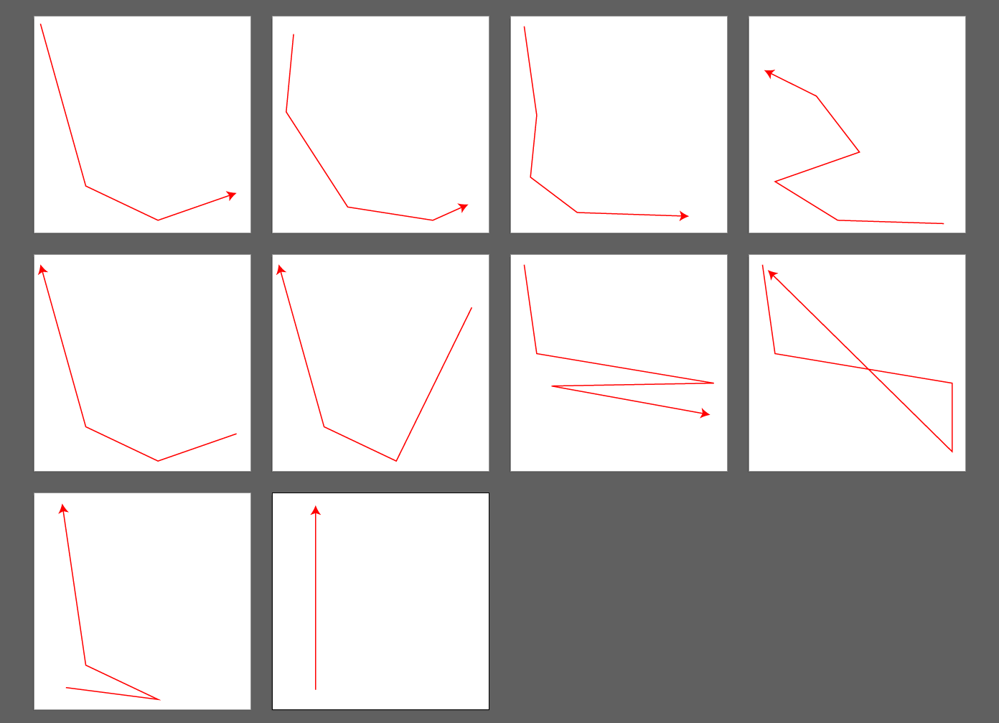

# illustrator-Path-Join
- An extension to join paths on Adobe illustrator CC.
- Adobe Illustratorで2つのパスの交点を補完し、結合するスクリプトです
- [GitHub](https://github.com/kotodu/illustrator-Path-Join/)

## 最新版のダウンロード
- ver0.1.0 - zxp
    - [./release/ipj_0.1.0.zxp](./release/ipj_0.1.0.zxp)

- バージョン履歴は、[CHANGELOG.md](./CHANGELOG.md)を参照のこと

## 特徴
1. ボタン1つですぐ結合します
2. 交点を補完した上で、端の余った部分は削除します
3. 2つのパスでない場合、結合しません

# 使い方
## 導入方法
1. ZXPデータをダウンロードする
1. ZXPをインストールする
    - [ZXPinstaller](https://zxpinstaller.com/)
    - [Anastasiy’s Extension Manager](https://install.anastasiy.com/)
    - 他にも方法はあるが上記を推奨
1. 上のメニューバー>ウィンドウ>エクステンション からillustrator-Path-Joinを選択する

# SS
## スクリーンショット
- ボタン1つのフラットデザインです😇

## 実行前

## 実行後

# 活用例
- illustratorをGISのように使用する
    - 地図制作など、特に大量に線をつなぐ必要のある場合
- ボタン1つでパス2つの正確な交点をすぐ求めたい
    - 昨今のIllustratorにはパスの延長でこの希望を実現可能だが、若干の手間がかかる

## 参考 : illustratorで2つのパスを結合する
- [以前自分の書いたscrapbox記事](https://scrapbox.io/wetradia/2%E3%81%A4%E3%81%AE%E3%83%91%E3%82%B9%E3%81%AE%E4%BA%A4%E7%82%B9%E3%81%AB%E7%82%B9%E3%82%92%E3%81%86%E3%81%A3%E3%81%A6%E3%83%88%E3%83%AA%E3%83%9F%E3%83%B3%E3%82%B0%E3%81%97%E3%81%9F%E3%81%84(%E3%83%90%E3%82%B9%E7%B5%8C%E8%B7%AF))の内容より。
- https://helpx.adobe.com/jp/illustrator/how-to/join-trim-paths-lines.html
    - パスの連結ツールを使う。基本はこれでOK
- https://helpx.adobe.com/jp/illustrator/using/scaling-shearing-distorting-objects.html
    - 線がつながっていない場合、拡大縮小ツールを用いて線を重ねる
    - 拡大縮小ツールでどこかタップすると、基準点を移動できる
    - ダイレクト選択ツール(A)で伸ばしたい線分を選択し、基準点で伸ばしたくない側のアンカーポイントを選択
    - Shiftを押しながら伸ばすことで、傾きを変えないで線分を伸ばせる

# 技術情報 : パス結合基準やデザインについての説明
- パス2つの端点4つの結合パターン4通りのうち、交点を考慮せずに結んだ最短距離が近いものを結合に使う
- 選んだ結合パターンの線端のみを用いて、交点を算出する
- 既存のパス1+交点+既存のパス2と結ぶ
    - もし延長せずに線端内に交点がある場合、端点を新たなパスに含めない
- 2つのパスのうち、下にあるパスを複製し、新たなアンカーポイントを追加するような処理をしている
    - つまり、必ず下にあるパスのデザインが新たなパスに踏襲される

# 今後の改良予定
- 結合後のパスが分かりにくい点の改善
- 下にあるパスより、上にあるパスのデザインを踏襲するよう改善
    - 結合後、1つ目のパスと2つ目のパスの中間に、結合後のパスが生成されてしまう為

# 本拡張機能についてのお願い
- 不具合を発見した場合、GitHubのissuesより報告をお願いします
    - [https://github.com/kotodu/illustrator-Path-Join/issues](https://github.com/kotodu/illustrator-Path-Join/issues)

# Licence
- Copyright 2020 kotodu (MIT Licence)
